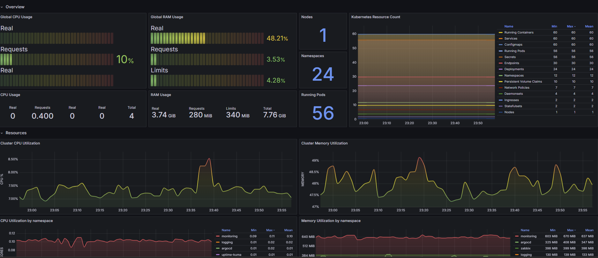
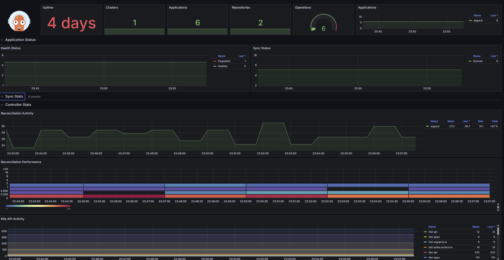
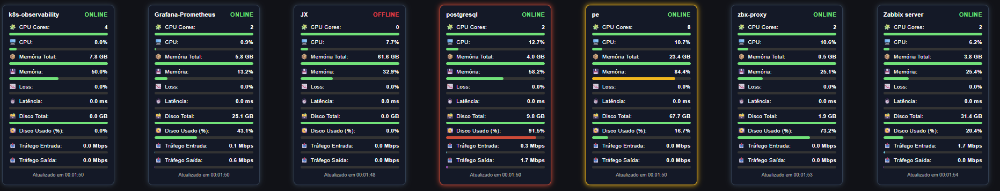
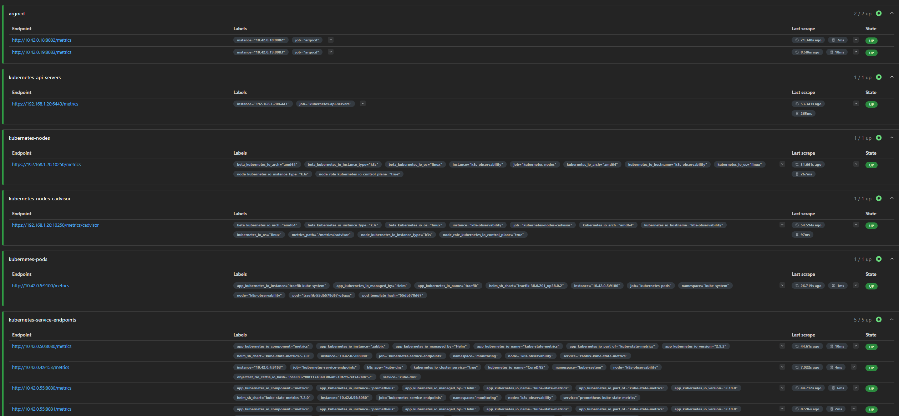
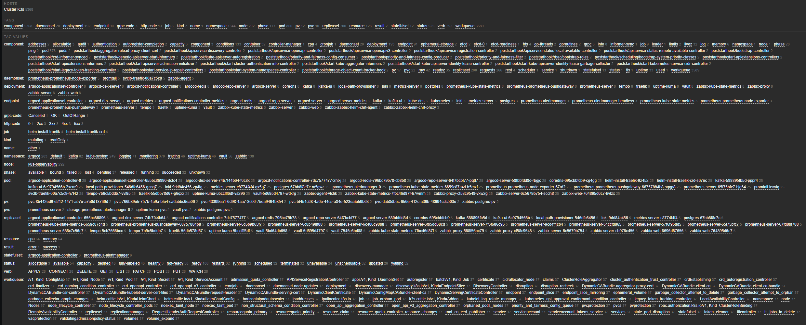
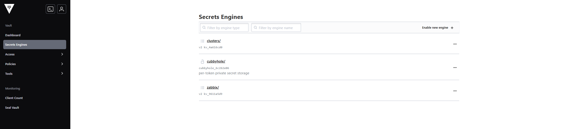
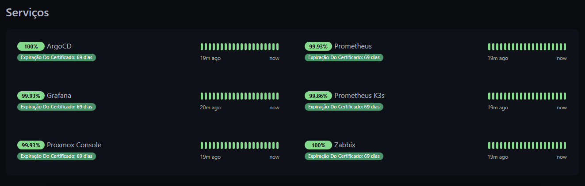

# 🚀 Homelab Observability Platform (k3s + GitOps)

## 🎯 Objetivo

Projetar e operar uma plataforma Kubernetes baseada em **k3s**:

- GitOps
- Observabilidade (Métricas, Logs e Traces)
- Monitoramento tradicional integrado
- Gestão segura de segredos
- Exposição via Ingress

O objetivo é simular um ambiente de produção para estudos em **DevOps / SRE /Platform Engineering**.

---

### 📌 Ambiente
- Proxmox:
    - VM Zabbix(Ubuntu 24.04.4)
        - 2 vCPU
        - 8GB RAM
    - VM LTGM(Ubuntu 24.04.4)
        - 2 vCPU
        - 8GB RAM
    - VM K3s (Ubuntu 24.04.4)
        - 4 vCPU
        - 8GB RAM
    - LXC Cloudflare Tunnels
        - 1 vCPU
        - 512MB RAM

---

### Camadas

1. Stack de Ferramentas K3s
   
| Camada | Ferramenta | Função |
|--------|------------|--------|
| Kubernetes | k3s | Orquestração de containers |
| GitOps | Argo CD | Controle declarativo do cluster |
| Métricas | Prometheus | Coleta e armazenamento de métricas |
| Logs | Loki | Agregação de logs |
| Traces | Tempo | Distributed tracing |
| Monitoramento | Zabbix | Monitoramento híbrido |
| Secrets | Vault | Gestão segura de segredos |
| Ingress | Traefik | Exposição de serviços |
| Storage | Local Path Provisioner | Provisionamento de volumes |

2. Camada On Premises(Legado)
   
| Camada | Ferramenta | Função |
|--------|------------|--------|
| Monitoramento Infraestrutura | Zabbix Server | Servidor principal responsável pela consolidação de métricas, alertas e gerenciamento de hosts, rodando fora e dentro cluster k3s |
| Monitoramento Metrics + Dashboard | Prometheus + Grafana | Coleta, armazenamento e visualização de métricas de ambientes externos e internos do cluster k3s|
| Exposição Externa | LXC Cloudflare Tunnels | Publicação segura de serviços internos para a internet sem exposição direta de portas públicas |

---
## ☸️ Kubernetes com k3s

A plataforma utiliza **k3s** como distribuição Kubernetes leve e otimizada para ambientes com recursos limitados.

### 🎯 Motivo da escolha

- Instalação simplificada
- Baixo consumo de recursos
- Componentes essenciais embarcados
- Ideal para homelab e ambientes de estudo avançado

O k3s já inclui:

- CoreDNS
- Traefik (Ingress Controller)
- Local Path Provisioner (Storage)
- Metrics Server
- containerd como runtime

+
---
## 🔄 GitOps

Utilizando **Argo CD**, todo o estado do cluster é versionado em Git.

---

## 📊 Observabilidade – 3 Pilares

### 📈 Métricas

Implementação do **Prometheus** como solução principal de monitoramento cloud-native dentro do cluster k3s.

- Prometheus  
- Node Exporter  
- kube-state-metrics  
- Grafana  

Responsáveis pela coleta, armazenamento e visualização de métricas do cluster e dos workloads, permitindo análise de performance, consumo de recursos e criação de alertas.

### 🎯 Objetivo

- Coletar métricas do cluster Kubernetes
- Servir como base para observabilidade da plataforma

### 📜 Logs
- Loki
- Promtail

### 🔎 Traces
- Tempo

---

## 📊 Monitoramento Híbrido

## Zabbix

Implementação do **Zabbix Proxy e Zabbix Agent** via *zabbix-helm-chart* dentro do cluster k3s.

- Monitorar workloads do Kubernetes via Zabbix Agent
- Centralizar coleta através do Zabbix Proxy
- Integrar o cluster k3s a uma infraestrutura externa
- Simular arquitetura corporativa híbrida

Essa abordagem reproduz um cenário real onde:

- Kubernetes opera como workload moderno
- Zabbix Server permanece centralizado fora do cluster
- Proxy atua como intermediário entre cluster e servidor principal

Isso permite coexistência entre:

- Monitoramento cloud-native (Prometheus)
- Monitoramento tradicional (Zabbix)

---

## 🔐 Segurança

Utilização do **HashiCorp Vault** para gerenciamento centralizado e seguro de segredos da plataforma.

### 🎯 Objetivo

- Armazenar credenciais, tokens e senhas de forma segura
- Evitar exposição de secrets diretamente em manifests Kubernetes
- Proteger tokens e credenciais utilizadas pelo Zabbix
- Centralizar a gestão de segredos em uma camada dedicada de segurança

## ⏱ Monitoramento de Disponibilidade

Utilização do **Uptime Kuma** para monitoramento externo de disponibilidade dos serviços expostos pelo cluster.

### 🎯 Objetivo

- Validar disponibilidade dos endpoints publicados via Ingress
- Monitorar status HTTP e tempo de resposta
- Complementar a observabilidade interna do cluster

O Uptime Kuma atua como camada adicional de verificação, garantindo que os serviços estejam acessíveis do ponto de vista do usuário final.

---

## 📦 Namespaces Organizados

- `argocd`
- `monitoring`
- `logging`
- `tracing`
- `zabbix`
- `vault`
- `uptime-kuma`

---

## 🧪 Troubleshooting Real

Alguns cenários enfrentados:

- Teste implantação Kafka (ImagePullBackOff)
- Restart loops
- Duplicidade de Monitoramento
- Expose services lab
- Problemas de storage
- Ajustes de recursos (CPU/Memória)
- Perca de PV e PVC

---

## 🚀 Próximos Passos

### Fase 1:

- [ ] Melhorar uso Vault
- [ ] Refazer estrutura kube-prometheus-stack
- [ ] Upgrade recursos
- [ ] Alertmanager
- [ ] Backup Strategy

### Fase 2:
- [ ] CI/CD pipeline
- [ ] Multi-node cluster
- [ ] OpenTelemetry Collector
- [ ] Estudos Kafka

---
