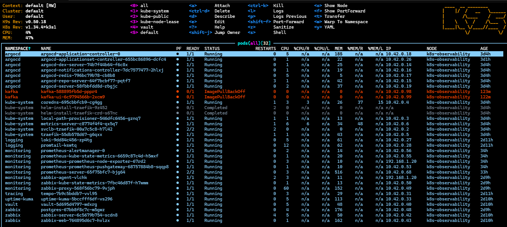
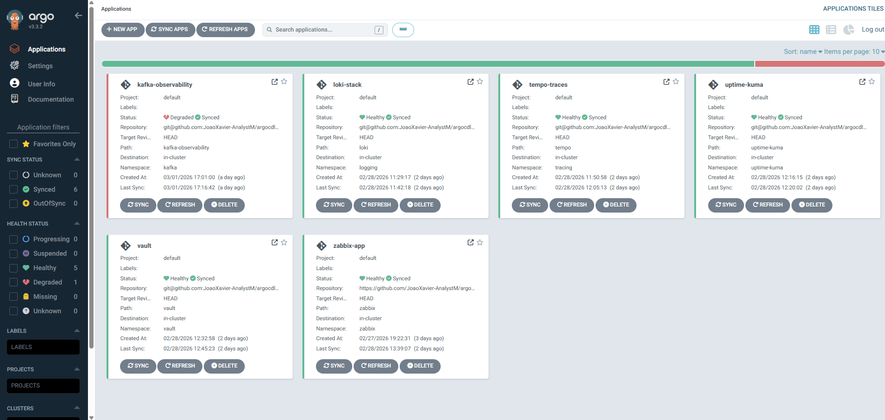

# 🚀 Homelab Observability Platform (k3s + GitOps)

## 🎯 Objetivo

Projetar e operar uma plataforma Kubernetes baseada em **k3s**:

- GitOps
- Observabilidade (Métricas, Logs e Traces)
- Monitoramento tradicional integrado
- Gestão segura de segredos
- Exposição via Ingress

O objetivo é simular um ambiente de produção para estudos em **DevOps / SRE /Platform Engineering**.

---
Esta seção documenta o processo de instalação do cluster Kubernetes utilizando **k3s**.

---

### 📌 Ambiente
- Proxmox:
    - VM Linux (Ubuntu 24.04.4)
    - 4 vCPU
    - 8GB RAM
- Cloudflare Tunnels

---

### Stack Principal

| Camada | Ferramenta | Função |
|--------|------------|--------|
| Kubernetes | k3s | Orquestração de containers |
| GitOps | Argo CD | Controle declarativo do cluster |
| Métricas | Prometheus | Coleta e armazenamento de métricas |
| Logs | Loki | Agregação de logs |
| Traces | Tempo | Distributed tracing |
| Monitoramento | Zabbix | Monitoramento híbrido |
| Secrets | Vault | Gestão segura de segredos |
| Ingress | Traefik | Exposição de serviços |
| Storage | Local Path Provisioner | Provisionamento de volumes |

---
## ☸️ Kubernetes com k3s

A plataforma utiliza **k3s** como distribuição Kubernetes leve e otimizada para ambientes com recursos limitados.

### 🎯 Motivo da escolha

- Instalação simplificada
- Baixo consumo de recursos
- Componentes essenciais embarcados
- Ideal para homelab e ambientes de estudo avançado

O k3s já inclui:

- CoreDNS
- Traefik (Ingress Controller)
- Local Path Provisioner (Storage)
- Metrics Server
- containerd como runtime

+
---
## 🔄 GitOps

Utilizando **Argo CD**, todo o estado do cluster é versionado em Git.

---

## 📊 Observabilidade – 3 Pilares

### 📈 Métricas
- Prometheus
- Node Exporter
- Kube State Metrics
- Grafana

### 📜 Logs
- Loki
- Promtail

### 🔎 Traces
- Tempo

---

## 📊 Monitoramento Híbrido

Integração entre:

- Stack cloud-native
- Zabbix Server
- Zabbix Proxy
- Zabbix Agent

Simula cenários corporativos reais onde múltiplas ferramentas coexistem.

---

## 🔐 Segurança

- HashiCorp Vault para gestão de segredos

---

## 📦 Namespaces Organizados

- `argocd`
- `monitoring`
- `logging`
- `tracing`
- `zabbix`
- `vault`
- `uptime-kuma`

---

## 🧪 Troubleshooting Real

Alguns cenários enfrentados:

- ImagePullBackOff (Kafka)
- Restart loops
- Expose services
- Problemas de storage
- Ajustes de recursos (CPU/Memória)
- Configuração de Ingress

---

## 🚀 Próximos Passos

- [ ] Upgrade recursos
- [ ] Alertmanager
- [ ] Backup Strategy
- [ ] CI/CD pipeline
- [ ] Multi-node cluster
- [ ] OpenTelemetry Collector
- [ ] Kafka funcional + UI

---